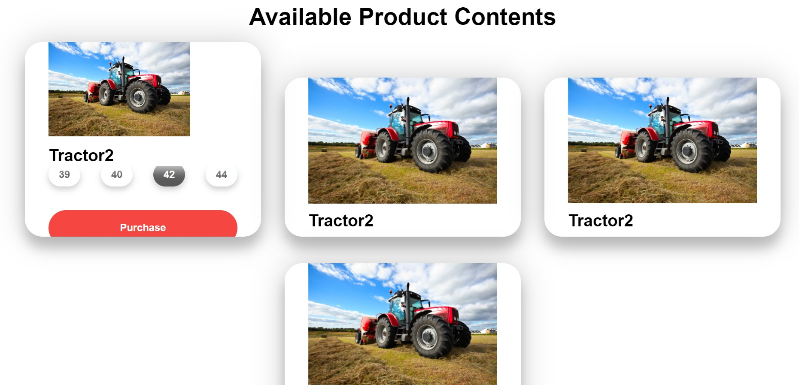
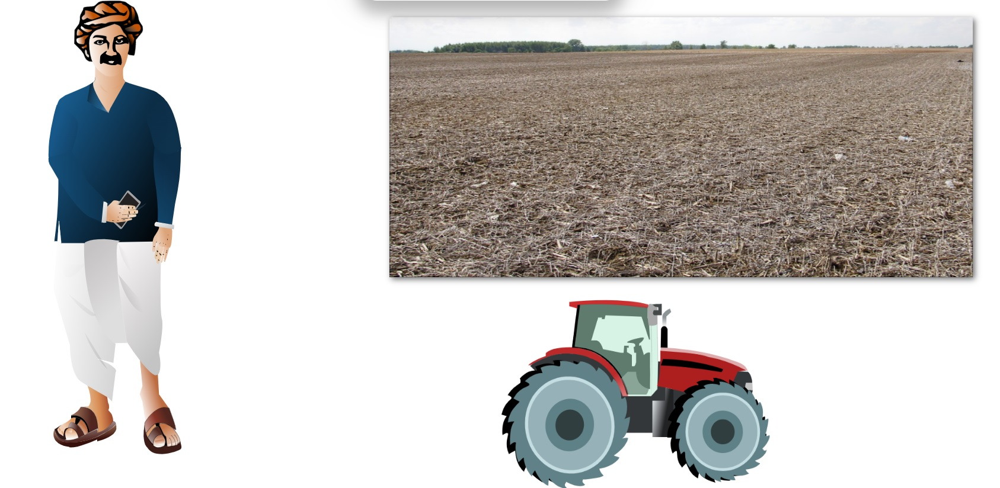
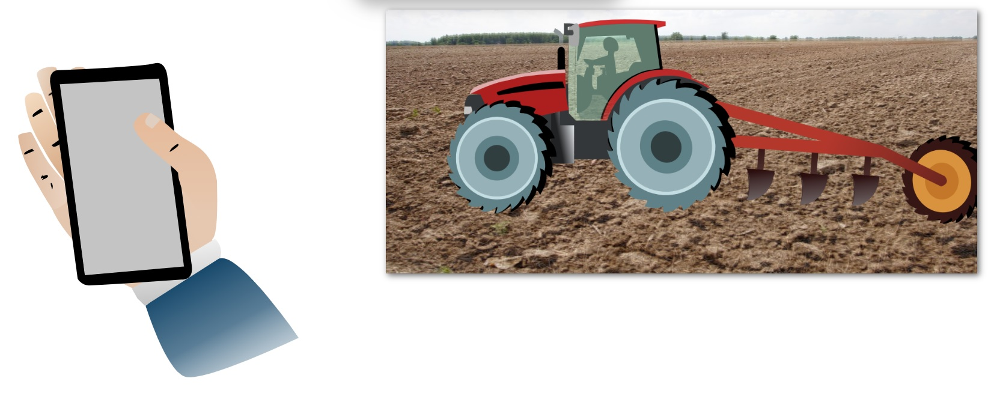
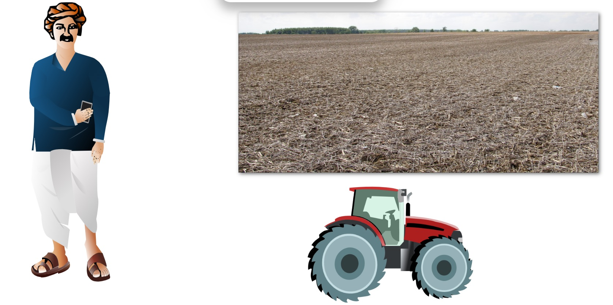
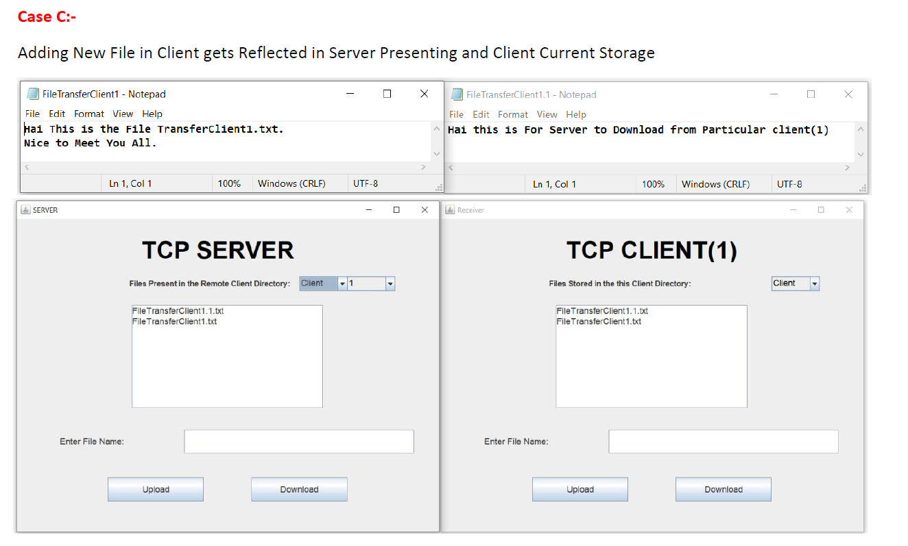

<h1>
Self_Interested_Projects
</h1>

<h2> Index </h2>

1. [Project_Tractor](./Project_Tractor)
2. [SASTRA_PRUVITY](./SASTRA_PRUVITY)
3. [SatelliteImaging](./SatelliteImaging)
4. [Static_Page_Handler-main](./Static_Page_Handler-main)
5. [FILE_TRANSFER_USING_DATAOUTPUT_STREAM](./FILE_TRASFER_USING_DATAOUTPUT_STREAM)
6. [Image_Segmentation](./Image_Segmentation)

<h1>1. Project TRACTOR </h1>

[Project_Tractor](./Project_Tractor)

Deployed Version:- [https://project-tractor.herokuapp.com/](https://project-tractor.herokuapp.com/)

For more information:- [README.md](./Project_Tractor/README.md)

The Animation was done using 

<table>
    <tr>
    <th></img></th>
    <th></img></th>
    </tr>
<tr>
    <th></img></th>
    <th></img></th>
    </tr>
<tr>
    <th></img></th>
    <th></img></th>
    </tr>
</table>

<h1>2. SASTRA PRUVITY APP</h1>

[SASTRA_PRUVITY](./SASTRA_PRUVITY)

For more information :- [README.md](./SASTRA_PRUVITY/README.md)

<table>
    <tr>
    <th></img></th>
    <th></img></th>
    </tr>
</table>

<h1>3. Satellite Imaging (Uses Tensorflow Serving,docker,heroku) </h1>

[SatelliteImaging](./SatelliteImaging)

For more Information:- [README.md](./SatelliteImaging/README.md)

</img>

<h1>4. Static Page Handler with Python controller (eg for controlling redirection etc)</h1>

[Static_Page_Handler-main](./Static_Page_Handler-main)

For more Information :- [README.md](./Static_Page_Handler-main/README.md)

<h1>5. File Transfer Using DataOutput Stream </h1>

[FILE_TRANSFER_USING_DATAOUTPUT_STREAM](./FILE_TRASFER_USING_DATAOUTPUT_STREAM)

For more cases handled by this File Transfer:- [SecureFile_Transfer_OUTPUT.pdf](./FILE_TRASFER_USING_DATAOUTPUT_STREAM/SecureFile_Transfer_OUTPUT.pdf)

</img>

<h1>6. Image Segmentation (Modified Original version to check how segmentation can be handled manually)</h1>

[Image_Segmentation](./Image_Segmentation)

For more Information:- [README.md](./Image_Segmentation/README.md)

<h1 align="center">Image Segmentation</h1>
<table border="5" bordercolor="black" align="center">
        <tr>
            <th colspan="3">Segmentation</th> 
        </tr>
        <tr>
            <th>Original</th>
            <th>Mask</th>
            <th>Segmented Image</th>
        </tr>
        <tr>
            <td></img></td>
            <td></img></td>
            <td></img></td>
        </tr>
</table>
